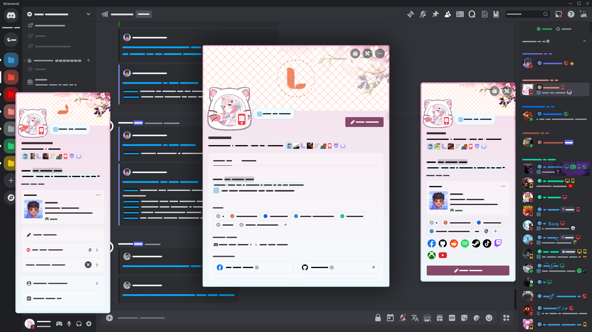

  
  <h1><strong>・fakeProfile</strong></h1>
  An <strong>all-in-one</strong></a> plugin to customize your Discord profile
   
  
  
  
   
  <h6>Wanna translate? Please fork and make pull request your translate repo.</h6>

<!-- MARKDOWN BADGED -->
 

  </a>
  </a>
  
   
  
   
  <h6><strong>Support For These Clients</strong></h6>
  

---

<!-- BODY -->

## 🖥️Selection

-   [fakeProfile](#fakeprofile)
    -   [❓What is fakeProfile?](#what-is-fakeprofile)
    -   [👍Contributors](#contributors)
    -   [❤️Final words](#%EF%B8%8Ffinal-words)
    -   [📘Wiki](#wiki)

## ❓What is fakeProfile?

  
  <h6><strong>Preview made by <a href="https://github.com/sang765">@sang765</a></strong></h6>

**fakeProfile** is a plugin for **Discord mod client** that supports all features related to nitro profile editing without need to use individual plugins to create a complete profile with features such as:

> -   ✅ Custom static and animated banner[^1] [^2].
> -   ✅ Custom static and animated avatar[^1] [^2].
> -   ✅ Choose Discord available badges or you can create your own badges[^1] [^3].
> -   ✅ Choose Discord/Custom profile effect[^1] [^2].
> -   ✅ Change theme profile color[^1] [^3].
> -   ✅ Select Discord/custom decorations[^1] [^2].
> -   ✅ Show **fakeProfile** plugin badges in chat[^1] [^3].
> -   ✅ We pride ourselves on our plugin being the **fastest** 🚀 and **fully automatic** 🔄 refresh every **2 minutes** from the latest request being approved without having to reload Discord or restart the client and of course you can also refetch the plugin manually(you'll need `VencordToolbox`(for Equicord users `EquicordToolbox`) if you don't want to wait[^1] [^3].
>     [^1]: This feature is only available to users of this plugin.
>     [^2]: The feature only works when other plugins related to this feature are disabled because other plugins can override that plugin's features on this plugin.
>     [^3]: This feature may work with some other plugins.

## 📘Wiki

For more information like as install and tutorial, QnA was moved to [wiki](https://github.com/TheLumiDevs/fakeProfile/wiki), please consider to read it.

> https://github.com/TheLumiDevs/fakeProfile/wiki

## ⚠️Disclaimer

> [!WARNING]
> - We are not responsible "if" you get **banned** from your discord client server if you use a third party build to get support. Clients **do not allow** open installation (uninstallation) and modification of plugins because they want to be able to easily control and debug their official plugins.
> - We only accept support for plugins made by "ourselves" or other plugins that have features related to our plugins. Other plugins that are not related to us "absolutely" have the right to refuse support in our Discord server.

## 👍Contributors

Thanks for support for this project:

  

## ❤️Final words

If you feel loved or interested in this project, you can leave us a **star** and share this project with people who have the same needs as you. That will be a great motivation for us to continue developing this project to make it become even better. Thank you so much.

  

<!-- END -->

---

 

  
  <h6>@2023-2025 <strong>Lumi Community</strong></h6>

