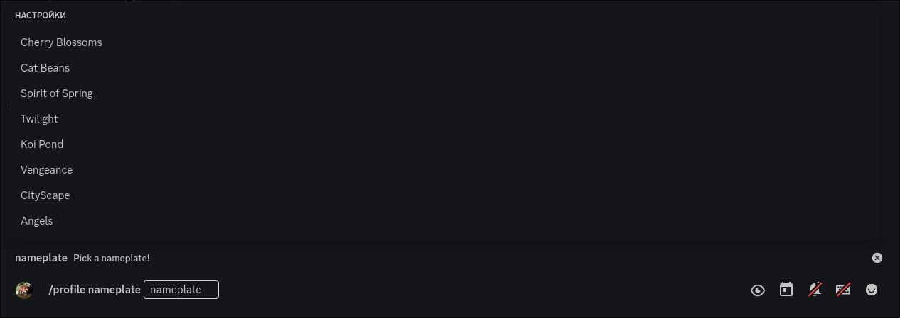
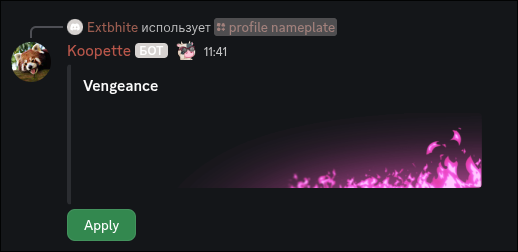

> [!WARNING]
> All actions will do in Discord server by the bot and these changes will be applied only on fakeProfile's side server not Discord's.
> **TO SEE CHANGES YOU NEED INSTALL PLUGIN. YOU WILL NOT SEE ANY RESULTS WITHOUT PLUGIN, CHECK [installation.md](/docs/installation.md) FOR INSTALLATION INFORMATION.**

### 1. How to request banner?

Click to read

 

- Go to [#command](https://discord.com/channels/1117373291095662623/1215640671457771540)
- Use `/profile banner upload` command like image below:

 

- All that's left for you is to wait until your request is approved in the [#fakeprofile-logs](https://discord.com/channels/1117373291095662623/1215640664373465129) and wait 2 mins or reload manually and done.

### 2. How to request avatar?

Click to read

 

- Go to [#command](https://discord.com/channels/1117373291095662623/1215640671457771540)
- Use `/profile avatar upload` command like image below:

 

- All that's left for you is to wait until your request is approved in the [#fakeprofile-logs](https://discord.com/channels/1117373291095662623/1215640664373465129) and wait 2 mins or reload manually and done.

### 3. How to choose a profile effect?

Click to read

 

- Go to [#command](https://discord.com/channels/1117373291095662623/1215640671457771540)
- Use command `/profile effects` `effects: Effect in options` like this:

  

- When you feel the effect is suitable, press the **`Apply`** button to apply that effect.

  

- After that wait 2 mins or reload manually and done.

### 4. How to choose default discord badges or request a custom badge?

Choose default badges

 

- Go to [#command](https://discord.com/channels/1117373291095662623/1215640671457771540)
- Use command `/badges select` `name` like this:

 

- Wait 2 mins or reload manually and done.

Request custom badges

 

- Upload your badge to Imgur
- Copy URL of your future badge like this by right-click:

 

- Go to [#command](https://discord.com/channels/1117373291095662623/1215640671457771540)
- Use command `/badges add` `Name` `Icon` like this:

 

 > Where `icon` you need just place your copied URL from Imgur

- All that's left for you is to wait until your request is approved in the [#fakeprofile-logs](https://discord.com/channels/1117373291095662623/1215640664373465129) and wait 2 mins or reload manually and done.

### 5. How to manage my badges?

Click to read

 

- Go to [#command](https://discord.com/channels/1117373291095662623/1215640671457771540)
- Use `/badges view` like this image:

 

- You can manage with badges like that:

 

- Wait 2 mins or reload manually and done.

### 6. How to choose an avatar decorations?

Click to read

 

- Go to [#command](https://discord.com/channels/1117373291095662623/1215640671457771540)
- Use command `/profile decorations` `decoration: Decoration in options` like this:

  

- When you feel the decoration is suitable, press the **`Apply`** button to apply that decoration.

  

- After that wait 2 mins or reload manually and done.

### 7. How to change profile theme color?

Click to read

 

- Go to your profile settings
- Choose your own colors in the Nitro preview
- Click the "**Copy 3y3**" button
- Paste the 3y3 text anywhere in your **_About Me_**

  

### 8. How to remove avatar or banner?

Click to read

 

- Go to [#command](https://discord.com/channels/1117373291095662623/1215640671457771540)
- With **avatar** use `/profile avatar remove` command:

  

- With **banner** use `/profile banner remove` command:

  

- After send that commands wait 2 mins or reload manually is done.

### 9. How to apply nameplates and remove then?

Click to read for apply

 

- Go to [#command](https://discord.com/channels/1117373291095662623/1215640671457771540)
- Type command `/profile nameplates`:

    

- Choose any nameplate(type name of nameplate) what you want and then press to apply.

    

- Reload fakeProfile or wait 2 minutes.

#### How to remove
- Go to [#command](https://discord.com/channels/1117373291095662623/1215640671457771540)
- To remove your nameplate type command `/profile nameplate_remove`, then send it and you'll get your nameplate removed. You need also wait 2 minutes or reload it youself.